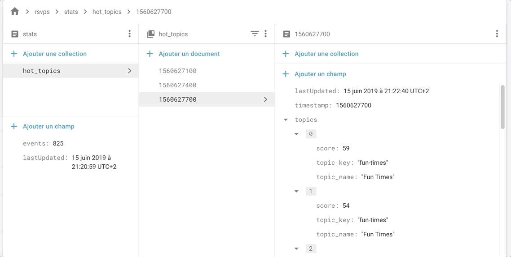

## Meetuplytics
> THAT'S A WORK IN PROGRESS: Realtime Meetup "Répondez, s'il vous plaît" (RSVPS) analytics built upon Apache-Beam (streaming processing). Using Cloud Pub/Sub for events ingestion/data circulation, Cloud Functions as a trigger + post-processing and Cloud Firestore as a storage.

### About

Visualize hot topics by countries, responses type, locations types etc. from dataset generated by Meetups RSVPS events. In near Real-time.

# WORK IN PROGRESS

### Implementation


### Sample outputs:



### Run the pipeline locally :

> Requires apache-beam[gcp] package and Python 2.7

You need to set up your owns Pub/Sub I/O topics and project.

[Get Started with Python for Dataflow](https://cloud.google.com/dataflow/docs/quickstarts/quickstart-python)

```
$ python pipelines/rsvps-meetups-tpl.py
```

### References:

- [Streaming 101: The world beyond batch - Tyler Akidau](https://www.oreilly.com/ideas/the-world-beyond-batch-streaming-101)
- [Streaming 102: The world beyond batch - Tyler Akidau](https://www.oreilly.com/ideas/the-world-beyond-batch-streaming-102)
- [Triggers in Apache Beam - Kenneth Knowles](https://www.youtube.com/watch?v=E1k0B9LN46M)
- [Watermarks - Slava Chernyak](https://www.youtube.com/watch?v=TWxSLmkWPm4)
- [Beam Documentation](https://beam.apache.org/documentation/)
